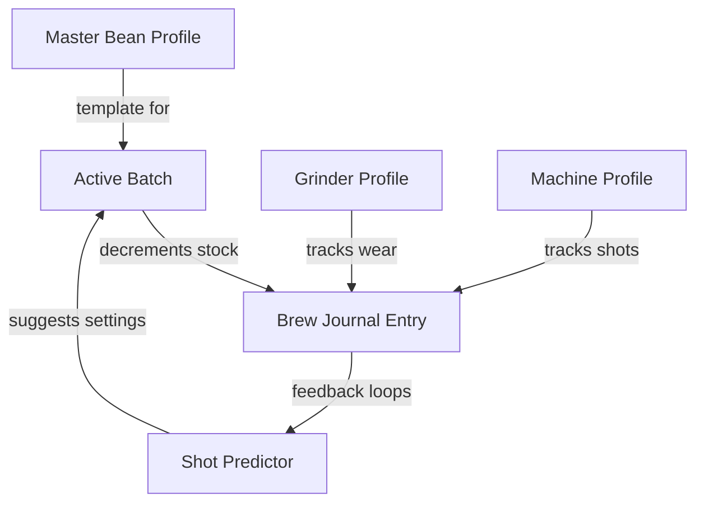

# Breaking Beans ☕️

<table align="center">
  <tr>
    <td align="center">
      
       
      <i>The sovereign Home Assistant espresso journal & management engine.</i>
    </td>
  </tr>
</table>

### 🚀 [Breaking Beans Documentation](https://github.com/TheRealSlimSchaali/breaking-beans)

---

## 🌟 Vision

**Breaking Beans** is a standalone Home Assistant integration designed to master the end-to-end espresso workflow. It handles relational coffee inventory, gear maintenance, and a precise brewing journal with predictive intelligence.

### Core Pillars
1.  **Sovereignty**: 100% local, no cloud dependencies.
2.  **Precision**: Relational data model prevents statistical skew between bean purchases.
3.  **Intelligence**: Heuristic shot predictor that learns from your personal taste profile and bean aging.

---

## 🏗 Data Model & Flow

Breaking Beans uses a relational structure to ensure that your statistics remain accurate even when you brew the same bean variety across multiple purchases.

---

## ⚡️ Key Features

- **Relational Bean Management**: Define "Bean Origins" once. Track every unique "Batch" purchase separately ($/kg, weight, roast date).
- **Auto-Inventory Management**: Automatically decrements your bean stock in grams based on logged shots.
- **Hardware Maintenance Entities**:
  - **Grinder**: Tracks total throughput (kg) with "Clean Me" thresholds.
  - **Machine**: Tracks total shots with "Backflush" alerts.
- **Shot Prediction Engine**: Suggests grind setting, dose, and yield based on:
  - Last 7 shots analysis.
  - **Degassing Factor**: Adjusts finer as beans age (-0.05 setting per week).
  - **Palate Feedback**: Analyzes your Acidity/Bitterness ratings to fine-tune extraction.
- **Mobile-First Card**: A bespoke Lovelace UI (compiled LitElement) optimized for kitchen use.

---

## 🛠 Installation

### via HACS (Recommended)

1. Open **HACS** -> **Integrations**.
2. **Custom Repositories** (top right) -> Path: `TheRealSlimSchaali/breaking-beans` -> Category: **Integration**.
3. Download and **Restart Home Assistant**.
4. **Settings** -> **Devices & Services** -> **Add Integration** -> **Breaking Beans**.

---

## 🚀 Step-by-Step Setup

Since it is a local storage integration, it starts empty. Set it up using **Service Calls**:

### 1. Equipment Registry
- `breaking_beans.add_grinder`: Specify model and cleaning threshold.
- `breaking_beans.add_machine`: Specify model and backflush threshold.

### 2. Coffee Registry
- `breaking_beans.add_bean_option`: Create a master profile (e.g., "Halo Beriti").
- `breaking_beans.add_bean_batch`: Register the specific bag you just opened. Provide the `bean_id` from step 1.

---

## 🌍 Localization
Supported languages: 🇬🇧 English, 🇩🇪 Deutsch, 🇮🇹 Italiano.

---

## 📜 License
Apache License 2.0. Developed by [@TheRealSlimSchaali](https://github.com/TheRealSlimSchaali).

---

  Developed with ❤️ for the coffee community.

